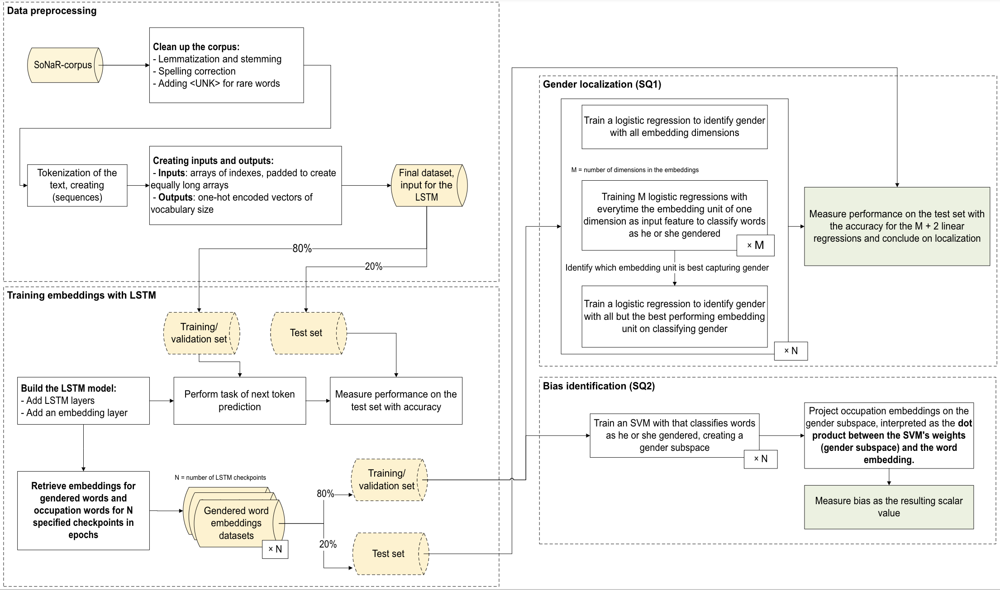

# Quantifying Gender Bias in Dutch Word Embeddings

This repository contains the code and analysis for my Data Science & Society thesis on detecting and quantifying gender bias in Dutch word embeddings. The project leverages LSTM and Transformer models to track gender representation in embeddings, employing SVM-derived gender subspaces to analyze localization and evolution of biases over time. The research uses the SoNaR-corpus.

## Contents
- **Data Preprocessing**: Scripts for preparing the SoNaR-corpus, including tokenization and cleaning.
- **Model Training**: Implementation of LSTM and Transformer models for creating Dutch word embeddings.
- **Bias Detection**: Classifiers and SVM tools to identify and quantify gender bias.
- **Analysis**: Analyzing the evolution and localization of gender bias in embeddings.
- **Evaluation**: Visualizations and results documenting embedding behaviors and gender localization.

## Repository structure

| File                      | Description |
|---------------------------|------------|
| `bert.ipynb`             | First experimental code with BERT, not the final script |
| `corpus_to_azure.py`      | Script to upload parts of the local corpus to Azure |
| `data_exploration_lemma.ipynb` | Data exploration at the lemma level (incomplete) |
| `data_exploration.ipynb`  | Exploratory Data Analysis (EDA) on the corpus |
| `data_sentences.py`       | Script handling sentence-level data processing |
| `visualize_results.ipynb` | Visualization of model training results |

