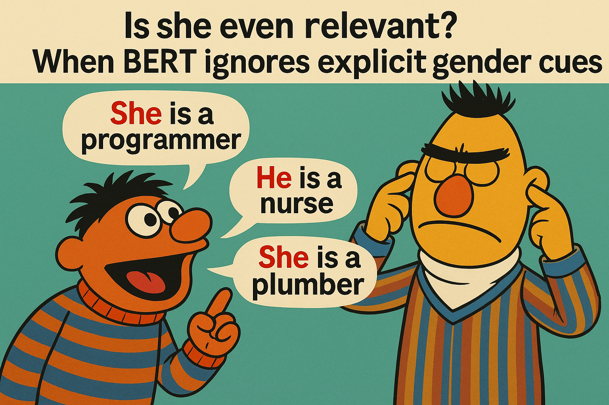

# Is She Even Relevant? When BERT Ignores Explicit Gender Cues

## Thesis Code Repository

This repository contains the full codebase and analysis pipeline for the thesis:

**"Is *She* Even Relevant? When BERT Ignores Explicit Gender Cues"**

*by Jonas Klein, Tilburg University, 2025*

---

## Abstract

If a model knows what a plumber is but always imagines him as a man, what exactly does it __know__? This project investigates the emergence and encoding of gender bias in a Dutch BERT model trained from scratch on the SoNaR-500 corpus. Through extracting contextual embeddings at different training checkpoints and constructing dynamic SVM-based gender subspaces, we track how the model learns and encodes gender. Our findings show that stereotypical associations dominate over contextual gender cues—even in cases where explicit morphology or syntax contradicts them.



---

## Data pipeline


---

## Repository Structure

```
biasintransformers/
├── assets/
│   └── images/
│       └── Bert&Ernie.JPG
├── code/
│   ├── corpus_to_azure.py
│   ├── train_bert.py
│   ├── run_train_bert.sh
│   ├── results_to_container.py
│   ├── SVM_dataprep.py
│   ├── run_svm_dataprep.sh
│   ├── test_model.py
│   ├── SVM_BERT_full_dimensions.ipynb
│   ├── SVM_BERT_recall.ipynb
│   ├── sentence_templates_acc.ipynb
│   └── data_exploration.ipynb
├── out/
│   └── [output files and results]
├── .gitignore
└── README.md
```

---

## Code File Descriptions

| File (in code folder)            | Description                                                                                                               |
| -------------------------------- | ------------------------------------------------------------------------------------------------------------------------- |
| `data_exploration.ipynb`         | Explores the gender distribution and linguistic features of the corpus and profession terms.                              |
| `corpus_to_azure.py`             | Uploads Dutch SoNaR-500 corpus files to Azure Blob Storage for downstream training.                                       |
| `train_bert.py`                  | Processes the corpus, trains a Dutch BERT model from scratch with a custom tokenizer, and saves checkpoints.              |
| `run_train_bert.sh`              | SLURM batch script to train BERT on a compute cluster using `train_bert.py`.                                              |
| `results_to_container.py`        | Uploads trained model checkpoints and datasets to Azure Blob Storage using selective checkpoint logic.                    |
| `SVM_dataprep.py`                | Extracts contextual word embeddings from checkpoints, labels them by gender, and prepares data for bias analysis via SVM. |
| `run_svm_dataprep.sh`            | SLURM batch script to run the embedding extraction for SVM training.                                                      |
| `test_model.py`                  | Downloads model, tokenizer, and dataset from Azure; evaluates BERT on MLM objective.                                      |
| `SVM_BERT_full_dimensions.ipynb` | Analyzes dimensional contributions of BERT embeddings to gender classification performance.                               |
| `SVM_BERT_recall.ipynb`          | Compares recall scores of gender predictions (male vs. female) over training time.                                        |
| `sentence_templates_acc.ipynb`   | Projects profession embeddings from template sentences onto the gender subspace to evaluate stereotype alignment.         |

---

## Citation

If you use this code, please cite:

```
@mastersthesis{klein2025genderbias,
  title={Is She Even Relevant? When BERT Ignores Explicit Gender Cues},
  author={Jonas Klein},
  school={Tilburg University},
  year={2025},
  url={https://github.com/KleinJonasUVT/biasintransformers}
}
```

---

For questions, feel free to [open an issue](https://github.com/KleinJonasUVT/biasintransformers/issues) or reach out.

---